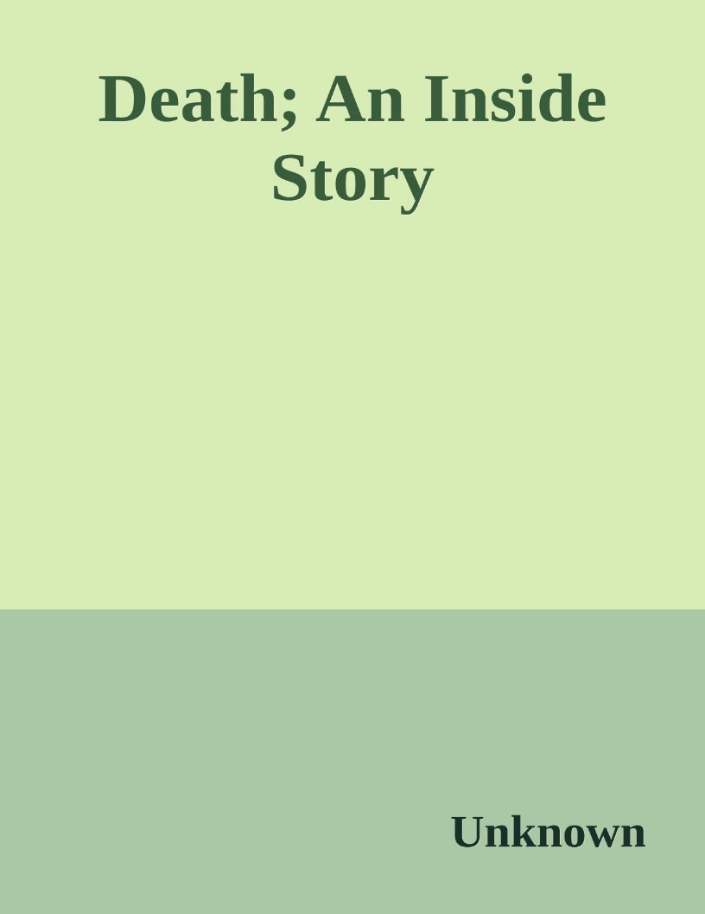
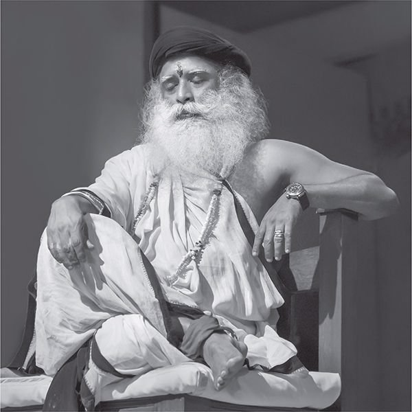



![ref1]

SADHGURU![ref1]

DEATH

*An Inside Story*

PENGUIN BOOKS

Contents

[*Death Blow: An Introduction*](#_page9_x76.50_y552.00)

[**PART I: Life and Death in One Breath *Death***](#_page16_x76.50_y220.50)

[**Chapter 1: What Is Death**](#_page17_x76.50_y540.75)

[Death: The Most Fundamental Question ](#_page17_x76.50_y540.75)[Mortal Nature](#_page19_x76.50_y496.50)

[Exploring Death](#_page24_x76.50_y72.00)

[Is Death a Calamity](#_page27_x76.50_y222.75)

[Stop Inviting Death](#_page30_x76.50_y455.25)

[**Chapter 2: The Process of Death** What Makes Us Tick](#_page33_x76.50_y563.25)

[A Bubble of Life and Death ](#_page40_x76.50_y647.25)[Understanding Life and Death](#_page48_x76.50_y276.75)

Pancha Pranas: The Five Vital Energies The Sequence of Death

Chakras: The Gateways of Exit **Chapter 3: The Quality of Death** Types of Deaths

Predictions of Death

Negative Energies

Suicide: A Perspective

Succour for the Suicidal

The Consequences of Suicide

**Chapter 4: Can Death Be Hacked**

Cheating Death

The Dance of Death

Transmigration

Seeking Immortality

Seeking the Next Dimensions

**Chapter 5: Mahasamadhi**

Samadhi and Death

Enlightenment and Death

Mukti and Mahasamadhi

A Few Mahasamadhis

**PART II: The Gracefulness of Death *Become Me***

**Chapter 6: Preparing for a Good Death** Does Death Need Preparation

Sleep, Ojas and Death

Why Do People Fear Death

How to Deal with the Fear of Death

How to Live One’s Old Age

The Wisdom of Vanaprastha Ashrama The Practice of Sallekhana

The Significance of Dying in Kashi

**Chapter 7: Assistance for the Dying**

The Importance of the Last Moments of Life Helping Suffering People Die

About Dying at Home

Rituals from Death to the Disposal of the Body

Is It All Right to Donate Organs

Dematerializing the Body

**Chapter 8: Assistance for the Disembodied**

Why Are After-death Rituals Needed Runanubandha—The Web of Debt

Kalabhairava Karma—An After-death Ritual at Isha The Scope of Kalabhairava Karma

Training People for Death Rituals

The Death of Infants

The Parent–Offspring Connection in the Afterlife The Importance of Death Anniversaries

Ancestor Worship

Of Heaven and Hell

**Chapter 9: Of Grief and Mourning**

The Essential Nature of Grief

Going beyond Grief

Articles of the Dead

Empathetic Death

Large-scale Death and Its Consequences Mourning Period

Memorials, Samadhis and Pyramids

**PART III: Life after Death**

***The Dark One***

**Chapter 10: The Life of a Ghost**

What Are Ghosts

Ghost Troubles

Ghost Solutions

Dissolving Frozen Beings

Nirmanakaya

Downloading Beings

**Chapter 11: The Riddle of Reincarnation** Taking on a New Body

The Arithmetic of Reincarnation

Past-life Recollection in Children

Exploring Past Lives

Baby Hitler

Couples for Lifetimes

The Only Enduring Relationship

Life beyond a Thousand Moons

Birth: Always a Beginning

The Rebirth of Lamas

My Past Lifetimes

Will I Come Back

**Chapter 12: Final Round**

One Drop Spirituality

Once You Made a Mistake of . . . *Footnotes*

*Chapter 1: What Is Death*

*Chapter 2: The Process of Death Chapter 3: The Quality of Death Chapter 4: Can Death Be Hacked Chapter 5: Mahasamadhi*

*Chapter 6: Preparing for a Good Death Chapter 7: Assistance for the Dying* *Chapter 8: Assistance for the Disembodied Chapter 9: Of Grief and Mourning Chapter 10: The Life of a Ghost*

*Chapter 11: The Riddle of Reincarnation Chapter 12: Final Round*

*Glossary*

*Follow Penguin*

*Copyright*

PENGUIN ANANDA

DEATH

Yogi, mystic and visionary, Sadhguru is a spiritual master with a difference. Absolute clarity of perception places him in a unique space, not only in matters spiritual but in business, environmental and international affairs, and opens a new door on all that he touches.

Ranked amongst the fifty most influential people in India, Sadhguru is known as a speaker and opinion maker of international renown. He has been conferred the Padma Vibhushan, India’s highest annual civilian award, accorded for exceptional and distinguished service.

Sadhguru has initiated large-scale ecological initiatives, such as Rally for Rivers and Cauvery Calling, to revitalize India’s severely depleted rivers.

These projects have found phenomenal support among India’s people and leadership. They are internationally accredited and recognized as game changers that can establish a blueprint for global economic development that is ecologically sustainable.

Sadhguru has been a primary speaker at the United Nations General Assembly and several other UN forums. He has also been regularly invited to speak at establishments such as the World Economic Forum, the World Bank, the House of Lords, the University of Oxford, MIT, Google and Microsoft, to name a few.

With a celebratory engagement with life on all levels, Sadhguru’s areas of active involvement encompass fields as diverse as architecture and visual design, poetry and painting, aviation and driving, sports and music. He is the designer of several unique buildings and consecrated spaces at the Isha Yoga Center, which have received wide attention for their combination of intense sacred power and strikingly innovative aesthetics.

Three decades ago, Sadhguru established the Isha Foundation, a non-profit human-service organization, with human well-being as its core

commitment. Isha is supported by over nine million volunteers in more than 300 centres worldwide.

[app.sadhguru.org ](http://app.sadhguru.org/)[isha.sadhguru.org ](http://isha.sadhguru.org/)[facebook.com/sadhguru ](http://facebook.com/sadhguru)[twitter.com/SadhguruJV ](http://twitter.com/SadhguruJV)[youtube.com/sadhguru ](http://youtube.com/sadhguru)*Death Blow*

*An Introduction*

We all want to live well, and when it is time, die well too. This is the essence of most human aspirations. Within this, much, if not most, of human endeavour is dedicated to living well, and the outcome reflects it.

Humans have achieved much in terms of living well. We have managed to acquire more comfort and convenience than any other generation in the past. However, when it comes to dying well, it cannot be said that we die in any way better than our ancestors. Many factors explain why humans were successful with living better but not dying better—the most significant of them being the disparity between the way we treat life and death in our societies.

Everywhere in the world, life is mostly considered a success that is to be sung and celebrated, but death is considered a failure that is to be shunned and mourned. Oddly enough, in the construed dichotomy of life and death, it is ‘life’ that is a four-letter word, not ‘death’. Yet, in the world, it is death that gets the bad press. Death is a word whose mere utterance can hush dinner conversations. Children are taught never to utter the word at home, unless the God of Death chooses to visit while the adults are on a quest to invent overly woke euphemisms that try to mask the bluntness of the event with vanity.

It is said that humans do not know much about death because they do not know much about life in the first place. Death is a brief occurrence at the end of a long life. But even after having lived a full lifetime, people are clueless about simple questions about life—like, where did we come from and where are we going. So confusion about death is understandable. However, it must be acknowledged that in recent times, humankind has indeed travelled far from its simplistic understanding that

‘Life is God’s gift and death is His wrath.’

Traditionally, it was only religion that people looked up to for the unravelling of this mystery. Adjudication of matters related to death and

dying was mostly in the hands of shamans and priests of various kinds. It was only in the past couple of hundred years, when a slew of medical discoveries began making a considerable impact upon health and mortality on a global scale, that people began turning to modern science for answers on death and dying as well. The success of modern science in dealing with matters of death and dying can be seen in the phenomenal improvement in just two of the key global health parameters

—life expectancy and infant mortality. No better testimony to the success of modern medicine is needed than the burgeoning global population of 7.75 billion people on the planet. With this development, modern medicine has firmly dislodged everything else as the final adjudicators of all matters of life and death.

Modern science, characterized by objectivity and universality, has now enabled people to look at death in ways that were not possible before.

However, the blazing trail left behind by modern science is not without its blind spots, dangers and destruction. One major outcome of death being handled by modern science is what has come to be called the

‘medicalization’ of death. Death, especially in the more advanced countries, is no longer looked at as a natural phenomenon but as a medical condition, with even ordinary life events and conditions being treated as risks and diseases. Death being preceded by excessive and often aggressive medical interventions has become the new norm.

Moreover, humans have never been comfortable with their mortal nature. So the success of medical science has only breathed a fresh lease of life to the historic quest for immortality. Riding on the shoulders of modern science, people have now begun to speculate if deathlessness is not in fact the norm and death an aberration. It has emboldened people to wonder if death is not just one more disease that needs to be conquered

—something that our super sleuths in white coats will surely do within our lifetime. Our growing capability to interfere with the fundamental life process has undoubtedly increased our propensity to overdo it.

One reason why scientists appear akin to the six blind men studying an elephant—getting parts right while missing the whole—is their keyhole vision of life. Death—just as life—can be understood as having three components. There is a biological part, a psychological part and a

metaphysical part that causes the biology and the psychology to happen.

In recent times, our understanding of the biology of death has greatly increased. Today, we have a much better understanding of the point where, biologically, life ends and death begins. In terms of psychology too much progress has been made. What makes a person? Is it Nature or nurture? What is the role of each? These aspects too are much better understood. But the more profound questions of why death or life happens, and how, are still largely not understood.

Unfortunately, today’s science has access to the being only from the point where the body begins to the point where it ends. Science does not even acknowledge the possibility that something could precede life or succeed death. The hypothesis that life is just a chance occurrence in this vast universe of infinite permutations and combinations of factors is riddled with many holes. The simple fact that an unseen force abruptly turns on the biology for a period of time, and then turns it off equally abruptly, begs a deeper investigation even by the standards of science.

While science stops where the body drops, the religions of the world are full of speculation as to what happens after that, leaving one lost somewhere in the no man’s land in between. It is in such times that the presence of a yogi or a mystic like Sadhguru—who draws primarily from an inner experience rather than tradition or scriptures or academic learning —becomes invaluable.

Sadhguru is a modern mystic and a yogi who has touched and transformed the lives of millions of people around the world with his unique insight into life and the tools of self-transformation. One afternoon, almost four decades ago, Sadhguru, then a ‘young man at his cocky best’, had a deep spiritual experience that changed his world view and life entirely. ‘Suddenly, what I had thought all my life was me was all around. I did not know which was me and which was not me.’ It also made him deeply ecstatic. Over the next few months, the experience became more stabilized and a living reality. This spiritual realization also brought back a flood of memories of his past lives and a deep understanding of the process of life and death. This experience made Sadhguru set out with a plan to teach the whole world to live as joyfully and ecstatically as he does.

Over the past four decades, this has turned into a global movement aimed at self-transformation. But looking back it is unclear as to at what point did Sadhguru, who has been considered a foremost authority on joyful living, begin being regarded as an authority on death as well. Was it when he began recounting clearly his past lives? Or was it twenty-five years ago, when he articulated for the first time the purpose of his current life *—* to consecrate the Dhyanalinga, the dream of many accomplished yogis, which was entrusted to him by his Guru three lifetimes ago? Or was it when several people around him were able to recollect their association with him in their past lives spontaneously? It is not very clear when, but soon people began to turn to Sadhguru on matters of death and dying as well.

However, Sadhguru has not always been the most communicative about death. In fact, one would think he was being evasive. Too many people who thought they could extract the deepest secrets of life through a single innocuous question—‘What happens after death, Sadhguru?’—

have been disappointed. To their dismay, they were usually teased by responses like, ‘Some things are known only by experience!’ Others who wanted to know how to communicate with the dead were told to worry about communicating with the living first. People who asked about the existence of souls were told they had two of them *—* one under each foot.

Yet all his teachings and practices have not been without a tinge of death or more.

Sadhguru is probably the only person on the planet who would, in a deadpan tone, talk about death to a hall full of people, first thing in the morning during certain residential programmes. He would then lead them through a guided meditation on experiencing death first-hand. He is probably the only one who would teach the ‘The Way of Effortless Living’ by initiating people into a deathlike experience of meditation, to be practised twice a day. He is also the ambitious person who sets out to teach everyone in the world the ways to live joyously; but on finding that he is falling short, pragmatically embarks on teaching them methods to die peacefully at least. He is also the person who assures people, ‘If you have been initiated by me, or have made the mistake of sitting in front of

me totally, even for one moment, there is no rebirth for you.’ And the list goes on.

Once when we were filming Sadhguru for a DVD, somebody asked him, ‘Why is it that in most Eastern traditions, a very high level of sanctity is accorded to the moment of death? Why is it that the moment of death is granted a sort of a quasi-spiritual status?’ Speaking outside his usual script of deterrence, Sadhguru said that if the moment of death is handled properly

- if there was proper preparation, proper guidance and perhaps some outside help as well *—* then, in spiritual terms, even that which probably did not happen in life could happen in death. This was a revelation to me. I had never heard of anyone speak of death as a spiritual possibility.

  Some discussion followed this, but since it was mostly outside the scope of the video being filmed, Sadhguru did not elaborate further. I was very intrigued. Did Sadhguru just say that there is a big spiritual possibility hiding in plain sight in the much-feared, much-abhorred aspect of life *—* death? Was there a huge free ride waiting to be taken at the moment of death, and we were oblivious to it? If so, why haven’t we heard of this before? Why is it not being spoken about more? Why are we not alerting people to it? Could Sadhguru offer the necessary guidance for the preparation, could he give the required ‘help’? Of course, he could. But would he? Could he be coaxed into opening another front in his engagement with the world? Sadhguru was certainly willing, but the task of compiling the book was not as easy as I had imagined. I had assumed it would be a simple task because, after all, if one knew something, how difficult would articulating it be? Well, that assumption turned out to be somewhat premature, because explanations can only traverse from the known to the unknown, and in this case, the gap turned out to be rather formidable.

  The grand phenomenon of life cannot be constrained to the period between birth and death, as seen by modern science. It goes back all the way to the beginning of Creation and extends all the way to wherever the Creation is heading. Hence, any understanding of death that does not take this fact into account is bound to be incomplete and incorrect. In the first part of the book

- Life and Death in One Breath *—* Sadhguru

describes the essential mechanism of life and death using several approaches. He describes the Yogic understanding and further simplifies this using the example of the familiar soap bubble. Taking the discourse beyond the usual boundaries, Sadhguru traces the origins of life from the beginning of Creation to the cycle of birth and death that we all undergo.

He also talks about the different kinds of deaths and what choices we have in death. He concludes the first part by describing the highest form of death

- the dissolution of the Self *—* which is the goal of all spiritual seekers.

In addition to explaining the underlying mechanics of birth and death, one of the objectives of the book is also to help one achieve a ‘good’

death. In the second part of the book—The Gracefulness of Death *—*

Sadhguru clarifies what a ‘good’ death is and what preparations we can make for it. Moreover, when a person is dying, he is in the most vulnerable situation, unable to help himself. Sadhguru explains what assistance one can provide in such situations and the difference that can make for the dying person. He talks about how the person’s journey after death could be assisted by doing some simple acts. He also shares some precious insights into grief and how we can deal with it in a meaningful manner.

The afterlife is strictly not a part of the process of death and dying, but a by- product of it. In the third part of the book *—* Life after Death *—*

Sadhguru offers us insights into this much- misunderstood and maligned aspect of life. Here, Sadhguru talks about ghosts and spirits, their origins and their lives, what they can and cannot do to us and how we can protect ourselves. He also talks about the process of reincarnation, what passes on from one birth to another and what is lost. He also examines if our previous lives are of any relevance to our present lives at all. In this context, Sadhguru talks about his own past lives and answers the question people frequently ask him—will he be coming back?

The book is in no way complete in presenting all that we seek to know about death and dying. Nor is it the sum total of all that Sadhguru has to offer. But we hope it will be an active force to dispel the gamut of misconceptions about death in the world. The most significant aspect of the book, however, is how the tools offered by Sadhguru and his

presence in our midst can help us make our own death more graceful and spiritually significant. In all the ensuing chatter about death and dying, it is hoped that this primary purpose of the book is not lost on the reader.

**Swami Nisarga**

PART I

*Life and Death*

*in One Breath*

Death

***Life and death live in me at once Never held one above the other When one stands far, life I offer In closeness, only death I deal In death of the limited***

***Will the deathless be***

***How to tell the fools***

***Of my taintless evil.***

C H A P T E R 1 *What Is Death*

*Death is the most fundamental question. Yet, people can ignore it, avoid it and just* *live on in their ignorance simply because all kinds of idiotic stories have been spread* *in the world in the name of religion.*

Death: The Most Fundamental Question

Do you know you will die one day? Oh, I bless you with a long life, but anyway, you will die one day. We cannot be sure about other things in your life. We don’t know if you will get married or not, or if you will get a job or not, if you will be successful or not, but this one thing is guaranteed in your life: you will go straight to your grave! One of the biggest human follies is to engage with death in the third person, as though it is an abstract event that happens to other people, not us. Do you know that about 160,000 people in the world, who were alive yesterday, are not there today? Each second, two people die in the world. And one day, it is going to happen to you and me too. It does not take enormous research, or intelligence, or even education, to know this. This knowledge is inbuilt in every human being. Yet, we think we have an unlimited lease of life. This situation is best expressed in the Indian epic Mahabharata.

The five Pandava princes, who are the protagonists, are lost in the forests. Severely starved and parched, they scour the nearby hills for water and food. They spot a lake and, as they try to drink from it, they are confronted by a *yaksha* (a celestial being) in the form of a white crane who insists they answer his questions first. Refusing to be stopped by a mere bird, one by one, they try to drink from the lake and drop dead. Only Yudhishthira, the eldest of them, is left. Always the humble and righteous one, Yudhishthira ignores his thirst and engages with the yaksha, who fires a volley of questions about life at him. One of those

questions being, ‘What is the biggest wonder of life?’ Without hesitation, Yudhishthira famously answers, ‘Hundreds and thousands of living beings meet death at every moment, yet the foolish man thinks himself deathless and does not prepare for death. This is the biggest wonder of life.’ The yaksha is pleased with this answer, so he allows him to drink from the lake and also restores the lives of his dead brothers. This happened 5000 years ago, but the human psyche regarding death has changed very little since then.

Death is a very fundamental question. Actually, death is closer to us than the statistics we read about it. Each moment, death is happening in us at the organ and cellular levels. This is how, with just one look at your insides, your doctor knows how old you are. In fact, death began in us even before we were born. Only if you are ignorant and unaware does it seem like death will come to you someday later. If you are aware, you will see both life and death are happening every moment. If you as much as breathe a little more consciously, you will notice that with every inhalation there is life, with every exhalation there is death. Upon birth, the first thing that a child does is to inhale, to take in a gasp of air. And the last thing that you will do in your life is an exhalation. You exhale now, and if you do not take the next inhalation, you will be dead. If you do not get this, just do an exhalation, hold your nose and do not do the next inhalation. Within a few moments, every cell in your body will start screaming for life. Life and death are happening all the time. They exist together, inseparably, in the same breath. This relationship goes even beyond the breath. Breath is only a supporting actor; the real process is of the life energy, or prana, that controls physical existence. With certain mastery over prana, one can exist beyond breath for substantial amounts of time. Breath is a bit more immediate in its requirement, but in the same category as food and water.

Death is such a fundamental aspect, because if one small thing happens, you can be gone tomorrow morning. Why tomorrow morning

—one small thing now and you could be off the next moment. If you were like any other creature, maybe you would be unable to think about all this, but once one is endowed with human intelligence, how can you just ignore such a significant aspect of your life? How can you avoid it

and live on as if you are going to be here forever? How is it that after living here for millions of years of life, human beings still don’t know a damn thing about death? Well, they know nothing about life either. We know all the trappings about life, but what do you know about life as such?

Fundamentally, this situation has come about because you have lost perspective as to who you are in this Universe. If this solar system, in which we are, evaporates tomorrow morning, no one will even notice it in this Cosmos. It is that small, just a speck. In this speck of a solar system, Planet Earth is a micro speck. In that micro speck, the city you live in is a super- micro speck. In that, you are a big man. This is a serious problem. When you have completely lost perspective as to who you are, how do you think you will grasp anything about the nature of life or death?

One reason people can ignore death and continue to live on in their ignorance is simply that the religions of the world have spread all kinds of idiotic stories about life and death. They created some silly, childish explanations for everything. ‘How was I born?’ ‘The stork brought you.’

‘Where are you going to go?’ ‘To heaven.’ This explanation is very simple but absurd. At least, they could have chosen a more efficient mode of transport than a stork. Storks migrate only in a particular season, so all the children should have been born in that season alone, not during other times! Moreover, if people are so sure that they are going to heaven after they die, I ask them, ‘Why are you delaying your departure, then?

Why not go right now?’ All these silly stories have snuffed out the basic human curiosity about life and death. Otherwise, sheer curiosity—if not the pain and suffering of life—would have strongly propelled many people to seek answers to this fundamental question.

Mortal Nature

People always think that reminding themselves of God will make them spiritual. Not at all. If you keep thinking or believing in God, you will not do your job properly, but you think you will produce good results.

You will not study for your exam and you think you will be first in class because of your prayer. Such people become more brazen than others

about life because now they have God’s support. Always, people who believed that God is with them have done the most violent things on the planet. ‘God is with me’ gives you a new confidence, which is very dangerous. If you think of God this way, you will not become spiritual—

you could actually become very brazen and stupid.

Once it happened: there were two young boys—very energetic boys—

in a neighbourhood. Usually, when young boys are very energetic, they are in constant trouble. The same happened with these boys also. Their parents were very embarrassed by them because the entire community was

discussing their children. So, not knowing what to do, they decided to take them to the local parish priest to correct them. Because the boys would be too strong to handle together, the parents decided to take them to the priest separately. They took the younger boy first, made him sit down in the priest’s office and left. The priest walked in with his long robes and walked up and down the room a few times with a grave face.

The boy sat there, his eyeballs doing the ping-pong act.

As he walked up and down, the priest worked out a strategy. He thought, ‘If I remind this boy that God is within him, all his mischief will go.’ So he dramatically stopped mid-stride and, with a booming voice, asked the boy, ‘Where is God?’ The boy looked bewildered. He started looking all around because he thought God must be somewhere in the priest’s office. The priest saw that the boy was not getting the point.

Thinking that he should give him a little clue that God is within him, the priest leaned on the table and, pointing at the little boy, boomed again,

‘Where is God?’ The boy looked even more bewildered and looked under the table. The priest saw that the boy was still not getting it. So he walked around, came close to him and, tapping on the little boy’s chest, boomed again, ‘Where is God?’ The boy now got up and bolted out of the room. He ran to where his elder brother was and said, ‘We are in real trouble.’ The elder brother asked, ‘Why? What happened?’ He said,

‘They have lost their God and they think we did it.’

Thinking about God, you will think that you can do idiotic things in your life, and with a prayer, everything will be fixed. This is not becoming spiritual. It is only when you become conscious that you will also die, you will turn spiritual. Only when this awareness of mortality

seeps into you, you will turn inwards. The moment you address the mortal nature of who you are, you will also want to know what the source of this life is. You will develop the longing to know what this is all about, and what is beyond this thing. It will become a natural quest.

That is the spiritual process.

No one would seek spirituality if they did not know that they would die. When you are young, you think you are immortal. Slowly, as you get older, at least your body definitely reminds you that you are mortal. And when you are faced with death or the death of someone dear to you, you will surely begin to wonder what all this is about. If you are aware of the mortal nature of your life, where is the time to get angry with someone or to quarrel with someone or to do anything stupid in life? Once you come to terms with death, and you are conscious that you will die, you will want to make every moment of your life as beautiful as possible.

Those who are constantly aware of the mortal and fragile nature of Existence do not want to miss even a single moment; they will naturally be aware. They cannot take anything for granted; they will live very purposefully. Only people who believe they are immortal can fight and fight to death.

In the Indian tradition, cremation grounds are always held to be very sacred. When someone dies, even if it is someone that you do not know, it hits you somewhere. In any genuine spiritual practice, there is always the smell of death. If you go deep enough into it, it will remind you that you are mortal. Whatever sadhana 1 we have been teaching you, whether it is Shoonya, or Shakti Chalana, or Shambhavi Mahamudra—even more so with Samyama 2 —essentially, there is a tinge of death in it. If there is no tinge of death in it, there is no spirituality; it is just entertainment. If someone taught you a superficial la-la practice, it may make you feel good, but there is nothing more to it.

Traditionally, every yogi started his spiritual pursuit in the cremation grounds. In fact, many Masters have used this as a spiritual process.

Gautama the Buddha made it compulsory for his monks. Before he initiated anyone who came to him, he asked them to go and sit in the busiest cremation ground for three months, just watching the corpses burning. Even today, if you go to Manikarnika Ghat 3 in Varanasi, a

minimum of half-dozen bodies will be burning there at any given time.

And it is handled like a normal business, very casually. These days, there is not enough time for them to fully burn the body, because even before one body is fully burned, the next body has already come. So they throw this half-burned body into the river. It is actually very good for you to see that this is how people are going to treat you also one day.

When I was young, I had no knowledge of all this. But from the age of eight to seventeen, I happened to spend an enormous amount of time in the cremation ground. It simply intrigued me. Everyone talked about so many eerie things happening there; I had heard stories that spirits hang upside down from trees. I wanted to see these things for myself. So I spent many days and nights in the cremation grounds. There was one very close to our home and another at the foothills of Chamundi Hills.

The one at Chamundi Hills was very busy. Anytime you went there, there would be at least four or five bodies burning. Whenever I went trekking, I spent the nights there because the hill would be cold, but here there was a fire burning all the time. So I would sit by the fire and simply watch the burning.

There was also a lot of drama that used to happen around the pyre.

Usually, when people come with a body to the cremation ground, they are all crying like they have lost everything in life and all that. Then they set fire to the body. They stay there for half an hour or forty-five minutes and then they leave. The fire is still burning, but they leave. Probably they have other business to attend to, but I would sit there, watching. If you have carefully observed a body being burned on a pyre, the first thing that burns up is the neck because it is narrow. When this happens, unless they have made a large and proper arrangement of firewood, the half-burned head invariably rolls off the pyre like a football. It looks a little eerie—a head rolling off the pyre! Probably because firewood is expensive, or because they do not have sufficient experience in arranging a proper pyre, this used to happen often. It would happen after three-anda-half to four hours of burning. By that time, no relatives would be present, so I would be the one to pick up the heads and put them back on the pyre.

I spent many days and nights in the cremation grounds just sitting and looking and helping these bodies burn fully. It set forth a completely different kind of process in me. I know you would want to avoid this, but it is good to sit down and watch the bodies burning continuously. Living in the comfort of your house, it is very easy to think you are immortal.

But when a body is burning in front of you, it is not very difficult to see that this could be you tomorrow. Mentally and emotionally, there may also be reactions, but the most important thing is that your body perceives life in its own way.

The sight of another body burning deeply unsettles it. It brings a different kind of awareness and sense within you. Many things that you have imagined about yourself will all get burned in the cremation ground if you sit there and keep watching what happens.

When you are watching the bodies burn, you should not think about it.

Simply look at it; just look at it and look at it and look at it. After some time, you will see, it is just you. It is not any different. It is your own body. Once you can replace that body with yours and still sit there, there is a deep acceptance of death. This is not a psychological process. When your very body perceives the fragility of its existence, there is a very profound relief and acceptance. Once there is a deep acceptance of death, then life will happen to you in enormous proportions. It is only because you tried to keep death away, life has also stayed away from you. This is why almost every yogi spent a significant amount of time in the cremation grounds at some point or the other in his life.

Exploring Death

An incident occurred when I was still in school, which made me deeply intrigued by death. I was thirteen at that time. I was a fairly unusual child in school, but, usually, no one dared to tease me because I would beat them up. But there was this girl named Sucharita, who was a little crazy and, for some reason, she would go on teasing me, ‘Jaggi 4 the Great!

Jaggi the Great!’ I was irritated, but I ignored it. Once, after a school vacation, she did not come back to school. Every day, when her name was called during attendance, some of us would squeak out a female

voice and try to answer her attendance for fun. This happened for a few days. Then this girl’s brother, who was junior to us by two years in the same school, told us that his sister had died of pneumonia during the vacations. That really freaked me out. Not because someone had died, but because someone who was alive and here with us had vanished just like that.

I became deeply intrigued by this. This girl was my age, doing many things in class, and she was suddenly gone. They said she was dead, but I wanted to know where she could have gone. Until then, to me, it was only old people who died. But being of my age group, the girl had brought death to my doorstep. Now it was no more a curiosity question, but a very existential one.

I wanted to know where the hell do people go when they die and what happens after death. I had already asked these questions to many people even before this incident occurred. I had also spent a lot of time in the cremation grounds in the town, but still I did not know what happened after death. So I thought I would undertake a journey to death myself and see what happens.

My father is a physician, so he had a medicine cabinet at home. I knew there were lots of medicines in it. Among them, I found a bottle of Gardenal Sodium. It is a kind of barbiturate that can put you to sleep.

The bottle was supposed to contain a hundred tablets, but when I took them out and counted, there were only ninety-eight. Someone had opened it and used up two. I thought ninety-eight tablets should be strong enough a dose to cause death. Next, I went through my cupboard.

I had some money and lots of personal property like marbles, catapults and a few bird pets, which are of great value for a young boy. I decided to give them all away because I was going to die anyway. Some things I gave to my brother, the rest I distributed among my close friends. I told them I was leaving. They all thought it was one big joke. Then one day I decided that I

would do it that night. I did not eat my dinner that night because I knew if there was food in the stomach, these things may not work very well. I told my family I was not hungry and went to the terrace with the tablets. I popped in all the ninety-eight pills and just went to sleep, hoping that I would know where all the dead people go.

In the morning, they did everything to wake me up, but I would not wake up. Usually, it was always a little hard to wake me up in the mornings, but this time I just did not wake up at all. Then my father saw that I was limp. Everyone became terrified and took me to a hospital.

They did a stomach wash, put me on oxygen and all that, but I did not wake up. For three days, I was lifeless and in a deep sleep. On the third day, I slowly came awake. Still lying down on the bed, I slowly opened my eyes. The first thing I saw were the rafters in the ceiling above the bed. Immediately, I recognized where I was. I had seen those rafters many times before when I had visited my father at the Railway Hospital, where he worked. So there I was, lying in a bed in his hospital with all kinds of tubes sticking out of me. It was very frustrating, because I had gone through all this trouble hoping to see where one goes after death, and all I see are the damn rafters at the Railway Hospital!

That was a desperate attempt to know what happens after death, but I had learned nothing about it. The only consolation was that I learned that this was not the way to know. Later, I managed to bully my friends into returning most of the stuff I had distributed to them, and life carried on!

Many years later, when I was a young man living life at my cocky best, a deep experience came unasked that changed my perspective about life and death completely.

On one warm September afternoon, I was just sitting alone on a rock in Chamundi Hills. I had my eyes open—not even closed—when something began to happen to me. Suddenly, what I thought all my life as me was all around—my inside had become the outside. I did not know which was me and which was not me. The air that I was breathing, the rock on which I was sitting, the atmosphere around me—everything had become me. It was crazy because what was happening was indescribable.

What was me had become so enormous, it was everywhere. I thought this lasted a few minutes, but when I came back to my normal senses, the sun had set and it was dark. My eyes were open. I was fully aware, but what I had considered as myself until that moment had disappeared.

From the time I was eight years of age, I had not shed a single tear. But now, as I was sitting, tears were flowing to the point where my shirt was wet.

I have always been peaceful and happy—that has never been an issue.

But here I was, drenched with a completely new kind of blissfulness. It was about 7.30 in the evening. About four-and-a-half hours had passed like this.

When I went back home, this sort of experience became recurring.

They became more and more frequent. For a period of time, it was a bit of a war between a phenomenal experience with a flood of memory and my super-smart intellect. The intellect struggled; it would not give in.

The only thing that my mind could tell me is that I was losing my balance. But the experience was so beautiful that I did not want to lose it.

It was absolutely fantastic, but at the same time, somewhere I was thinking this could be some kind of madness going on because it was too good to be real.

Questions about death did not even come into the picture because life was happening in such proportions. But this experience made me realize that people don’t die. They may have disappeared from your perception, but they don’t die. They live on. I was flooded with lifetimes of memories and experiences that made me realize that the past few lifetimes for me were about the same work, in the same place and to some extent with the same people! It is this understanding of life (and death) that has shaped my life since then. In a way, death is a fiction created by ignorant people. Death is the creation of the unaware, because if you are aware, it is life, life and life alone—moving from one dimension of Existence to another.

Is Death a Calamity

People think that death is a tragedy. It is not. People living their entire lives without experiencing life is a tragedy. If you die, there is really no tragedy. That is the end of whatever problems you are experiencing in life. But if you are alive and not experiencing life in its totality, that is a true tragedy. This is expressed very beautifully in a Sanskrit verse. It says: ‘ *Jananam Sukhadam Maranam Karunam* ’. ‘Jananam’ means birth or life. It says life is a pleasure or joy. This is so. If you learn to handle your body and mind properly, your experience of life will be a pleasure

or joy. But ‘maranam’, or death, is ‘karunam’, or compassion. Death is compassion because it relieves you.

Right now, people have a distorted orientation of life. They don’t want to die. They don’t realize that if you were ever condemned to become immortal, or if death were taken away from you, it would be the most horrible thing to happen to you. However beautiful your life becomes, if death comes at the right time to you, you are very fortunate. If it comes late, if life stretches itself beyond a certain point, that will be the worst kind of suffering. Then you will find that when death comes, it will be a great relief. Life needs a certain amount of tension to keep it going, but in death, there is relaxation. In fact, death is the highest relaxation.

However, if you also know the relaxation of death when you are alive, then life becomes an utterly effortless process.

If we look at life and death as a happening in terms of your experience, your inhalation is life and your exhalation is death. You can experiment with this: take one big inhalation and see how your body and your mind are. Now do one big exhalation and see how your body and mind are. Which do you find is more relaxing? In fact, whenever tension builds up in you, the natural mechanism in the body wants to exhale.

This is what you call a sigh. It relaxes you a little bit. Life needs a certain tension. Otherwise, you cannot keep it going. Death is utter relaxation. This is how it would have naturally been if your mind had not banished death as evil.

If your traditions and cultures had not taught you that death is evil or a calamity that should be avoided, believe me, you would breathe in a completely different way. If you observe people around you right now, you will see that for almost 99 per cent of the people, their exhalation is never complete. Their mind has rejected death so their exhalation will not happen totally. They will inhale, but exhalation does not happen totally. This is one of the reasons why, over some time, you build up so much tension within the system that it is reaching a breaking point—both mentally and physiologically.

The greatest calamity of the human mind is that it is against death. The moment you reject death, you also reject life. You think life is right and death is wrong. It is not so. Life is what it is only because death is. A

river always happens between two banks. But you are standing on the right bank and say, ‘I don’t like the left bank, it should disappear.’ If the left bank disappears, the river also will disappear, the right bank also will disappear. If the right bank has to be there, the left bank also has to be there. It is like, could there be light without darkness? One who does not embrace death will not know life at all. If you sit here saying, ‘I don’t want to die, I don’t want to die, I don’t want to die,’ all that will happen is you will not live. You will anyway die, but by denying death, you will not live well until then either. If you are afraid of death, you will only avoid life; you cannot avoid death.

Even now, in some cultures, death is held as something that is to be celebrated, not mourned. After all, from somewhere you got released into this planet within this atmospheric space. Within that, however large a space you occupy, it is still a small prison. But death is an endless possibility. So there must be much more joy, much more of a sense of excitement about this than birth. For someone who is aware of this possibility, there is no such thing as life and death. Life is death, and death is life; they are not different.

Death is in fact life in a very intense form. People who have experienced moments of great danger in their life clearly know this. It once happened: two old men met in a tiny little town in Indiana, USA, in a local bar. And both of them were sitting grumpily at two different tables and drinking. Then one guy looked at the other and saw a birthmark on the other person’s temple. So he walked up to him and said,

‘Hey, is that you, Joshua?’ ‘Yeah, who are you?’ ‘Don’t you recognize me? I am Mark. We were in the war together.’ He said, ‘Oh my God!’

and they lit up suddenly. They were together in World War II and it had been fifty years since then.

So they sat down at one table and started drinking, talking and eating.

They had seen about forty minutes of action in those treacherous trenches of World War II in Europe. Forty minutes of blitz. They talked about those forty minutes in so many vivid ways for over two hours.

After they were done with all this talk, one guy asked the other, ‘What have you been doing since then?’ He said, ‘Ah, I have just been a salesman.’ Forty minutes of war, they spoke for two hours with great

excitement but fifty years of life after that were just summed up as, ‘I’ve just been a salesman!’ That is how it happens.

Moments of danger are moments when you experience both life and death together at the same time. These are the moments you realize that life and death are here at the same time. They are not two separate things. They are one inside the other. Life is all packed like this. The Creation and the Creator, life and death—are all packed one inside the other. It takes attention—a lot of attention—to see it. Otherwise, one just lives on the surface, half alive. If you don’t know life and death at the same time, you will know only one half of life. Being half alive is a torture always.

If you want to live as a full life, you should look at your mortal nature every day, not only when you are beyond a certain age. Every day of your life, you need to be aware that you are mortal. It is not that I want to die today, but if I do, it is all right with me.

I will do everything to protect myself, to nurture myself, to take care of myself, but if I have to die today, it is okay with me. Only then can I step out and live. Otherwise, I cannot live.

Stop Inviting Death

If avoiding death is avoiding life, dodging life is inviting death. For most people, if life becomes unpleasant or burdensome, then, knowingly or unknowingly, they start dodging life. Once you start dodging life, you are invariably inviting death. There is no better method in the world to dodge life except to invite death. Either you do it consciously or you do it unconsciously. One major contribution to the multiple, complex ailments that you see on the planet these days is that people are trying to dodge life and, in the process, are inviting death. The body is only cooperating with this. The body is just fulfilling your desire to invite death. Ask, and it shall happen!

People are trying to avoid life because they think it is unsafe. You should know that the only safe place on the planet is your grave. Nothing happens there. There is no safety in life itself. Like I said earlier, tomorrow morning you may be dead, no matter how much security you create for yourself. I am not wishing you this, but it does not matter how

healthy you are, how well you are right now, tomorrow you may be dead. It is a real possibility. So there is no such thing as security in this life.

The moment you start seeking security, naturally, you become death- oriented. Unknowingly, you will seek death.

In India, it is a tradition that whenever you see a sage or a saint, you should not miss the opportunity to get their blessings. So many times, people come to me and say, ‘Sadhguru, please bless me that nothing should happen to me.’ Really, what kind of a blessing is this? My blessing is that let everything happen to you. Let everything that is life happen to you. Have you come here to avoid life or to experience life? If you want to avoid life, I have better technology than Inner Engineering. 5

If you want to avoid life, all it takes is 2 metres of rope to hang yourself from the ceiling. And it is not expensive either! I am talking of efficiency; when alive, to try to avoid life is very negative. Our aliveness is a very brief happening but we shall be dead for a very long time. So taking one’s life is not really an option. This happens by mistaking the psychological drama for the existential life.

The moment you think of security, you are assisting death.

I want you to know: death does not need your assistance. Death is super- efficient. On the other hand, life needs your assistance. If you notice, whatever you do with life, no matter how much you do with life, there is still something more you can do with it. Life needs all your attention and efforts. Death does not need your support. It will anyway happen and it will happen with absolute efficiency. There is no failure here, as all shall pass.

People think nothing new should happen to them, but they want an exciting life. How is this possible? This is a no-win situation you are creating for yourself. What can happen to you at the most? At most, you will die. There is nothing more that can happen to you. And whatever happens in your life, you did not come here with an investment. You came empty-handed. You cannot lose in this life. See how wonderful it is! Whatever happens, you are still on the profit side, so what are you complaining about?

This happened about ten years ago. At that time, the stock market in India was going down. Some people in Mumbai brought a man to meet

me. It seems he was initially worth about Rs 250 million. Then he took a beating in the stock market. In about eight months’ time, he was worth only about Rs 30 million. Now the man was broken, depressed and wanting to commit suicide because he had only Rs 30 million. He was in a bad state, so they wanted me to help him. I thought this was funny because, for many Indians, Rs 30 million is more than heaven. If you give an option between heaven and Rs 30 million, they will choose Rs 30

million. But this man is depressed and wants to commit suicide because he has only Rs 30 million! This is not just about him; you are doing this to yourself all the time too!

Let new things happen to you. If you create this kind of nothing-should- happen-to-me situation within yourself, you will become stagnant. Stagnation is death. If life does not move on, if new possibilities don’t arise within you, you are living dead. This is the reason that even when nothing has gone wrong with people’s lives, you can see so many long faces on the street. For most of them, life has worked out far better than they ever imagined. Materially, we are all living much better than our fathers and grandfathers did. But still there are these long faces on the street. This is happening not because something has gone wrong. This is because of stagnation. You cannot live with stagnation because that is like living death.

Being ‘living death’ is a fantastic experience but to be deathlike when alive is horribly painful. If you are alive, it is wonderful. If you are dead, we are not bothered about you. There are too many dead people walking, which is why there is such misery on the planet. They were all bright and alive at one time; now, slowly, they are half into the grave. Yes, with time the physical body will deplete. That is why if only psychological and physiological processes are in your experience, it is only natural that with the passage of time, you will deplete. Only if the fundamental life energy is in your experience, if the right things are done about the life process, then you will not deplete with age and rather become greatly enhanced.

So it is only life which must be constantly cranked up. There is no need to invite or practise death, because death does not need your support.

C H A P T E R 2 *The Process of Death*

What you are calling as life, right now, is like soap bubbles being blown. The entire Yogic process or the entire spiritual process is to wear this bubble thin, so that one day when it bursts, there is absolutely nothing left and it moves from the bondage of existence to the freedom of non- existence, or Nirvana.

What Makes Us Tick

If you want to understand fundamentally how life and death work, you need to understand how Creation works and the role played by the various memories that are present in Creation. When I say memory, it is not only what you remember. Memory runs much deeper in its many layers. According to the Yogic system, memory is basically an accumulation of impressions. Further, there are fundamentally eight types of these memories in Creation. The most fundamental of these memories is *Elemental Memory.* According to the Yogic system, the first step from the unmanifest to manifest is the formation of *Pancha Bhoota* s, or the five elements. These elements are: [*prithvi* (](https://en.wikipedia.org/wiki/Prithvi)[earth](https://en.wikipedia.org/wiki/Earth) ), [*jal* ](https://en.wiktionary.org/wiki/%E0%A4%9C%E0%A4%B2)([water](https://en.wikipedia.org/wiki/Water) ),

[*agni* ](https://en.wikipedia.org/wiki/Agni)([fire ](https://en.wikipedia.org/wiki/Fire)[), *vayu* ](https://en.wikipedia.org/wiki/Vayu)([air ](https://en.wikipedia.org/wiki/Air)[) and *aakash* (](https://en.wikipedia.org/wiki/Aakash)[ether ](https://en.wikipedia.org/wiki/Aether_\(classical_element\))). The names represent a particular quality and not the substance itself. These fundamental elements have different characteristics and are manifest in all aspects of Creation and are the most fundamental basis of all Creation.

Of these, Elemental Memory is the memory that decides how these five elements interact and play out in life. The next layer of Creation is the material substance that the Universe is made of.

The rules of how they play out are contained in what we can call *Atomic Memory.* Today, every child is taught atomic theory in school. The word

‘atom’ comes from the Greek word *atomos* , meaning indivisible. When modern science discovered the atom, it was believed that atoms were indivisible and the most fundamental building blocks of the Universe.

Today, of course, we know that it is not so. Over two dozen subatomic particles have been since discovered and more are possible. Atomic Memory relates to how subatomic particles, atoms and in turn molecules of various physical substances are made and how they behave. Elemental Memory and Atomic Memory together constitute what can be called *Inanimate Memory.* This memory governs the inanimate aspect of life.

The other types of memory relate to animate life and can be called *Animate Memory* .

Of these, the most fundamental layer of memory is *Evolutionary* *Memory* , which relates to how the evolution of life has taken place. This is instrumental in you having two eyes, two hands, taking the shape of the human form and not any other creature, and so on. Upon this layer is *Genetic Memory* , which comes from the genetic material passed on by your parents that makes you the unique human being that you are among all the other humans. This memory decides the colour of your skin, the shape of your nose and other such things. The next layer of memory is *Karmic Memory* , which is an accumulation of all the impressions that you have gathered, not just since birth but all through your previous lives, and the process of evolution. This will play out in your life in so many ways beyond one’s understanding.

The next three layers of memory are impressions or accumulations related to your mind or the mental body. There is a large body of memory that you are completely unconscious about, which we can call *Unconscious Memory*

. Then there is another body of memory that is just beneath the *Conscious Memory* that we can call *Subconscious Memory* .

And, finally, there is Conscious Memory itself, which you can recollect and articulate. All these eight types of memory will play out in your day-to-day life according to the impressions accumulated and the situations you are faced with. Broadly speaking, these are the layers of memories that make you the life you are.

Now, there are many ways to look at the essential nature of life. One of them is that there are two seeds that make our lives. One is the seed planted by our parents, which gave us a body, and the other is the seed planted by the Creator, which gave us the life within. These are two different types of seeds or, in other words, two different dimensions of

Nature. The first is programmed for certainty, while the second is programmed for possibility. The body is physical and there is a sense of certainty of its existence. The life that you are beyond the physical is a debate for most people; most are uncertain of the nature of their existence.

The seed of physicality that was transmitted by our parents has a certain set of rules, traits and compulsions of its own. This aspect of Nature only tries to survive. The survival process includes procreation. It always tries to avoid everything that threatens its survival. Now, our parents gave us just a seed and that became the body. But what the Source of Creation gave us was not a seed in that sense. It gave itself.

This is the reason that all the possibilities that the Source of Creation holds are kind of encapsulated in us. Whether that possibility is realized in an individual life or not is questionable, but the possibility is always there.

With these two seeds, when a human being is born a certain software is set within. This software is a combination of time, energy and the information that he or she carries with them from previous lives. These three together will determine various aspects of one’s life. Depending upon the information that is carried, energy is allotted for different aspects of life, which we will look at in a bit. In India, this information that is carried forth is referred to as karma. Of the entire memory or the entire lot of karma that one has, Evolutionary Memory is only significant for the structure of who one is. Let us leave it aside. But if all Genetic Memory and the Karmic, Unconscious and Subconscious Memories that you have flood into your Conscious Memory right now—you cannot deal with it. It will become too overwhelming. So out of this entire load, Nature has a way of apportioning a portion for you to handle or wear off in this birth in the form of different kinds of activity.

Traditionally, in Indian culture, the whole stock of Karmic Memory a person has is called *Sanchita Karma.* You can say Sanchita Karma is the entire warehouse of karma that a person carries. Out of this stock, a certain portion is allocated to be handled in a particular lifetime. This is known as *Prarabdha Karma* , or the karma that is allocated for that lifetime, which has some extra urgency to it and expresses a little more

compulsion than the rest of the heap. This is Nature’s way of handling something that is extremely complex in simple, intermediate steps. So at birth, Prarabdha Karma creates an orientation and Sanchita Karma creates an unconscious tendency towards various things. However, how much karma you perform daily and with how much awareness either releases you from your Prarabdha Karma and Sanchita Karma or it enhances the same. In a nutshell, these factors are what determine how and for how long a person will live.

In the natural course of life, even if one lives simply in unawareness, Prarabdha Karma will somehow get worked out. With a little suffering here and a little well-being there, a little pain here and a little pleasure there, one will work out one’s Prarabdha Karma. They just need to learn how not to create new karma in this life, that is all. So the next time when another set of Prarabdha Karma is allocated, that also will get worked out. This will repeat lifetime after lifetime. Now, Prarabdha Karma does not per se determine the outside situation, but it definitely arranges many things on the outside because your inner arrangements are always finding expression in the external situations. So in India, whenever one saw someone suffering, they would say, ‘ *Aiyyo* , 1

*prarabdha* !’ It used to be a common refrain because the suffering is mostly coming from within. In most cases, suffering is a consequence of *how* one carries their memory and not necessarily the content. Hence, the need to fix the *context* of one’s life through spiritual processes and not so much the content.

If you want to see how different people come with different karmic baggage, you should observe infants. How much of hand and leg movement one child does is very different from how much another child of the same age does. This is not because of the differences in parents. In fact, how much one baby kicks around in a mother’s belly is very different from how much another baby of the same mother kicks around.

Usually, it has very little to do with the parents. In fact, if you observe, a lot of lethargic parents suffer super-active children. This is not because of the attitudes and psychological limitations of the children either. That develops afterwards. This is because each ‘being’ comes with a certain level of energy allotted to activity at birth itself.

Now, even within the allocation of energy to each person at birth, it is further divided into various aspects. Let us say, according to your karmic structure, you came with 1000 units of energy when you were born. Of this, 250 units may be allotted for physical activity, and within that 100

units for involuntary activity and 150 units for external voluntary activity. Out of the rest, 300 units could be for mental activity and another 200 for emotional activity, and so on. This allocation will depend on what kind of software you have. This is why you will see each individual has a certain level of energy for different aspects of life. In children who have not yet been through much influence, this is very distinctly visible. You can see it in adults also, but in adults, this could also be ascribed to many influences in one’s life.

Now, the way the allocated energies are expended within you has serious implications on your life and death. In today’s world, because of the impact of technology, the energy allocated to physical activity is mostly unused in people. If you were on this planet 200 years ago, the level of physical activity that you would be performing naturally to fulfil your day-to-day requirements would be at least twenty times higher than what it is right now. In the tribal village near the Isha Yoga Center, no one has any sleep disorder. They put in so much physical activity that by the time they go to bed, they are ready to die. If they just put their head down on the pillow, they will fall asleep.

If you happen to travel on Indian roads, it is common to see labourers travelling on top of loaded trucks. They would have loaded some stones or bricks or some other material into the vehicle and they would also be travelling in it to unload at the destination. Usually, you will see them fast asleep, lying on bricks or stones or some other coarse material in the moving truck, even under the hot sun. This is because the level of their physical activity is such that they have used up all their allotted energy.

Now, if you initiate them into meditation, they will easily meditate. You will see that it is the educated people who cannot sleep or meditate or sit in one place because they are not using up their allotted physical energy.

When they don’t use it up, they cannot sit in one place. Right now, you see a huge upsurge in activities like trekking, cycling, running, etc. This is not only for fitness. Most realize that by just being in a demanding

activity, they sleep, think and act better. Their enthusiasm and energy for relationships and work are enhanced. In a way, in their consciousness, they

have managed to put their concerns about the body aside.

This is why, once you are on the spiritual path, we want you to exhaust your energies allocated for physical activity very fast. Let us say, you have 500 units of energy allotted to your physical activity. We want to finish it off in ten years so that after that if you sit, the body will simply sit. It has no need to move. Without any physical urge to move, it will simply settle down. Most people cannot meditate without sufficient physical activity. So, when we allocate work to people at the Isha Yoga Center, we do it with a lot of care. Some people work four hours a day, some six hours a day, some ten hours a day, some fourteen hours a day, while there are some who work eighteen to twenty hours a day. The idea is to expend their physical energy.

However, if you are full-time on a spiritual path, if you are a *brahmachari* , we not only want you to empty your Prarabdha Karma, we want you to expend the Sanchita Karma, or the entire stock, too. The idea of being on a spiritual path is to put life on fast forward. We don’t want you to take ten lifetimes to handle this warehouse of memory. We want you to finish it now. So we try to open up other dimensions of memory in you. The reason why so much discipline was always brought into Yogic practices is that even when things that would otherwise overwhelm you come up, you should be able to handle them. If you open up things for which one is not ready, karma can just smother you completely.

Once you are full-time on a spiritual path, we give you sadhana to handle this. Now, you are willing to walk into trouble. You are not dodging trouble any more. People want to avoid whatever is unpleasant in their life because they cannot handle it. Only once we know you can handle your Prarabdha Karma well, then we can open up the entire warehouse of memory. This is also the reason why, when a person walks the spiritual path, if they don’t handle the situation properly, they will suffer much more than other people. While others handle only what is allotted to them, this person tries to take up the whole stock.

Some people who are at the Yoga Center have gone through these phases: when they came, we gave them lots of activity. They went through it for a certain period and then slumped. They could not do anything for some time. They thought they were physically sick. They went to various doctors,

though I told them, ‘Don’t go to any doctor, just relax for some time. Something else will happen.’ And after some time, once again they are swept away by activity because we open up another room in the warehouse for them. What they should have done in their next life, they do it now. Actually, there are many more aspects to this—I am putting it in an overly simplistic manner. The main aim is that we want them to finish it all now.

This is also the reason why many spiritual systems in the East always had grammar and mathematics attached to them. Yogis want to develop their body and their mind because if they are born again, they don’t want to be born with small amounts of Prarabdha Karma and go on for many lifetimes. They don’t want to postpone it; they want to fast-forward everything. They want to enhance their mental capabilities, so that this time around, even if they were not able to end it, because they left with very great physical and mental capabilities, when they come next time, they will get a bigger software. They will get more Prarabdha Karma. So along with the spiritual process, people took to grammar, music, astronomy and mathematics, because they want to use their intelligence in every way.

Now, along with the memory and energy, there is a third dimension— time—that determines the duration and nature of one’s life and death.

Both life and death happen within the ambit of time. Time ticks away all the time. You can neither slow it down nor hasten it. You can conserve your energy, you can throw it around, you can develop it, you can make it phenomenally big or insipid, but time, it just keeps slipping away. It has its own intelligence, and it flows according to certain parameters of karmic information and the energy allotment that is available in one’s system. So can we not do anything about it? We can, but that is a much more elusive dimension of life than the other two. The other two are much easier to manage and manifest in one’s life. Generating energy and using it the way you want, not allowing your tendencies to determine the

nature of your thought, emotion and activity is far easier than taking charge of time. Even Adiyogi 2 took charge of time only when he was in certain states. When he was in such states where he took charge of time, we refer to him as Kalabhairava. 3

One who has mastery over one’s information, or mastery over the tendencies caused by the information, has mastery over the quality of one’s life. He or she can determine whether the self becomes pleasant or unpleasant. One who has mastery over one’s energies will determine the nature of one’s activity and how one lives. They have absolute mastery over their life, but not over their death. But one who has mastery over time will determine the nature of one’s life and death. They can determine whether they want to live or die. This is how the three dimensions that constitute your life are connected to your death.

A Bubble of Life and Death

People think in terms of life and death as a binary situation. You are either alive or dead. You are either walking and talking or you are dead and gone. This is a very superficial and simplistic way to understand life and death. In fact, it is incorrect.

Generally, the human perception of aliveness has always been that something must bleed, otherwise it is not alive. Not any more. Slowly, as science is advancing, our perception of what is alive and what is not is changing. Now we know that not just the plants and animals but even the rock and the soil are alive. The air is alive, the water is alive, the soil that you walk upon is alive and the very cosmic space is alive. Today, science proclaims that water has its own memory and intelligence. Someday, when science goes far enough, they will find that there is nothing in the Cosmos that is not alive. The important question is, are you alive enough to perceive it?

For me, even a rock is very alive. It has its own energy and I see that it gathers its own memory over a period of time. It lives with it. It is only based on this, that a Dhyanalinga 4 is consecrated. It is only based on this that every deity in India exists. If we give this combination of energy and memory a certain amount of vibrancy of energy, it will slowly gather an

intelligence of its own. Once it has a combination of all these three, it can have intent. Once it has an intent and the necessary energy to back it, it is capable of action. This is how life is.

Right now, our idea of death is like this: when people say something has died, it only means that something just relapsed from a dynamic to a more inert form of Existence. We recognize life as a certain level of dynamism, intent and capability of action in a human being. If this dynamism sinks below a certain level, then we say they are dead because, as far as our perception and our practical purposes are concerned, the things that we expect from a human being are no longer possible for them any more. He or she may rot, become maggots, become manure and then a mango or a coconut. All of them are life, but still we don’t consider them alive because they are not able to find expression as we expect of a human being.

Essentially, there is a scale of dynamism from zero to infinity. (Actually, there is no zero, that is the whole problem!) Let us say, Shiva

—that which is not—is zero, and what we consider as Divine is the highest level of dynamism. There are many levels of dynamism even among human beings. For example, let us say someone has Alzheimer’s disease. They don’t remember a thing, but this does not mean there is no memory in them. It is very much there, but the dynamism of the memory is gone. It has become inert. But if the memory goes away completely, your body also will fall apart right away because what you call as ‘this body’ is held together just by memory.

Right now, if a man eats a mango, it becomes a man. If a woman eats a mango, the same mango becomes a woman. You give the same mango to a cow, it goes inside a cow and becomes a cow. Is this the smartness of the mango? No. There is such a strong memory structure in you that whatever you put in, the memory will make sure it becomes you, not some other person. This is why if you eat a mango, one part of it becomes your skin in the same skin tone as yours; it does not turn yellow because the mango you ate was yellow.

Moreover, biologically also, a certain level of dynamism of memory is needed to bind all organs, cells and atoms together to our intention of living. Right now, you have trillions of cells in your body that are

functioning the way you want because there is a strong intent that is holding them together. But if you lose this intent, which is your ability to make all these atoms and cells function the way you want, we say you have died. The deterioration of the body begins to happen. The organism goes through certain disorganization, but it becomes a part of a larger organism of the planet, Universe or Cosmos. As an organism ages, it loses its intent. If you lose your intent, then, gradually, action goes first, then your conscious memory will begin withdrawing and along with that your energies will follow.

The air is alive, a rock is alive, a tree is alive, an animal is alive, a bird is alive and a human being is also alive. It is just that they have different levels of intent, different levels of intelligence and, above all, different dimensions of memory. 5 That is all. The volume of Conscious Memory that you are capable of determines your capability of intent. From an amoeba to a human being, it is only a question of complexity. Every creature has intent, but it is largely unconscious intent. Only with the human being there is conscious intent. That is what sets us apart. Right now, my unconscious intent may be that I want to eat. But my conscious intent is to write this book, which no other creature really thinks of. For them, whatever is their unconscious intent is also largely their intent.

Maybe dogs and a few other animals are capable of conscious intent in a small way, but, beyond that, everything is unconscious intent. But if a human being is willing, we can develop a large conscious intent from the banks of memory we have on various levels because there is such a huge foundation for this life.

If you want an analogy, consider this: in a way, what you refer to as life, right now, is like soap bubbles being blown. A rock, a plant and a human being are all like soap bubbles of different kinds. The layer of covering of the soap bubble is the complex amalgamation of memory—

various kinds of memory. In that sense, the nine avatars 6 that they talk about in the Hindu tradition are just different levels of Evolutionary, Genetic, Karmic, Unconscious, Subconscious and Conscious Memory.

The difference between a ‘human bubble’ 7 and a ‘rock bubble’ is just this: a rock bubble is mostly physical, with a thicker covering and less air inside, because all that is there is physical matter. It is only its physical

integrity due to Inanimate Memory that holds it together, not so much a conscious web. You can break it with a hammer and it will be gone. But if you break a human bubble with a hammer, only the body will break.

The web of Karmic Memory contained within is such that it will always find another way to create another bubble or physical form. The entire Yogic process or the entire spiritual process is to wear this bubble thin so that one day when it bursts, there is absolutely nothing left. It then moves from the bondage of existence to the freedom of non-existence, or *Nirvana* .

What I am saying might disappoint a lot of people because what I am telling you, in other words, is that there is no such thing as an encapsulated life. This whole thing about the soul, the ‘being’ and other fancy things are all made up to give solace to people. If you tell them there is no substance within them like that, they will become terrified. So what about the person or the personality? There is no such thing as ‘this person’ either. It is only a web of memory that creates an illusion of ‘this person’. This is why when a person’s memory is removed or dislodged in some way, like in Alzheimer’s disease or something else, their personality is one thing that dies immediately. Suddenly, they are not the same person any more. But still they have their own traits. It is like a scorpion has its traits that are very different from a grasshopper’s.

Similarly, people who have lost their memory will have different traits but no personality. If the Conscious, Subconscious and Unconscious Memories are gone, if they are either dislocated or maybe wiped out, the Genetic Memory will come into play. If the Genetic Memory is wiped out, then the Evolutionary Memory will play. Even then, life is not completely gone because it has not completely dissolved.

If you take out the memory altogether, if you pull the plug on it, it collapses completely and then the bubble cannot hold the air. Here, what you refer to as air is the fundamental life energy. You can call it consciousness. Consciousness is a quality, not a substance. It is the nature of the Cosmos. You just blew a bubble and caught some amount of it. What we are trying to do with conscious living or with sadhana is catch as much air as possible so that you are one big bubble, and the wall of the bubble becomes very thin. You don’t want to be a tiny little bubble

—you want to become one big bubble because dissolution is an imminent possibility for a sufficiently big bubble.

With sadhana, you blow a huge bubble. You want to blow this in such a way that it will never again exist anywhere as the same memory form.

For this, you have to grow it really big. Essentially, enlarging a bubble means making the wall thinner and thinner. With sadhana, you wear it out from the inside. You stretch it. You stretch it so much that it will burst one day. You make it so big, where the memory stretches itself so thin, that when it is broken, it is really gone. Suppose, somehow—either due to life experience or intelligence or wisdom or whatever—someone blew a big bubble, and it cannot be ignored any more. The moment such a life rolls out of the mother’s womb, it will depict certain qualities, simply because it is a big bubble. Everyone will be looking at that.

A hundred other bubbles may be floating about, but everyone will look at that. This is what we call an evolved ‘being’.

It does not matter whether one becomes a spiritual teacher or simply walks on the street—wherever the person is, people cannot ignore that being because there is a certain level of activity and intent.

Now, using this analogy, what happens when someone dies? Your physical self is largely an accumulation of Genetic Memory and Evolutionary Memory. The other dimensions of memory are not in it so much. It is the energy body which holds that memory, largely. So when death occurs, whatever memory you gathered on the surface—the Genetic, Evolutionary and other Memories—is gone but the deeper layer of Karmic Memory remains intact. Therefore, it seems to be almost eternal in your experience. It is in this context people say that the soul is eternal. It is not eternal, but in your experience, if something goes beyond your body, you call it eternal. In that sense, this long-term memory within you, which will carry on through death, which will determine the nature of your future life and experience, is eternal.

Of the eight types of memory that you carry, all the seven types of memory will go when you fall dead. Evolutionary Memory, which is instrumental in you taking the shape of the human form, is gone. Genetic Memory, which decides the colour of your skin, the shape of your nose and such things, is also gone. The Conscious, Subconscious and

Unconscious Memories are also gone. Once you become disembodied, it is largely only the Karmic Memory which holds you together. In the process of death or disembodiment and the continuation of life process, we must understand that only one memory—the Karmic Memory—

remains. Within this, you may categorize something as Sanchita Karma and something else as Prarabdha Karma, but, essentially, it is karma which remains. One way to handle this bubble is to capture a larger piece of life. Now, even if you did not do anything much about dismantling your karma, the karmic wall becomes very thin simply because the ‘life size’ became more.

The other way is to wear down the karmic wall. Very few people with properly intact karmic substance know how to just open the karmic wall and leave one fine day. The rest have to wear it down. The reason why an enormous amount of activity is generally prescribed on the spiritual path is that if you cannot blow your bubble thin from within, you try to wear it out from outside. Either way, you try to make the walls as thin as possible. The reason they said you should go and sit in a sacred place like the Dhyanalinga or some other energetic place or that you should go on yatras, and so on, is to fix your karmic body. The karmic body is subject to influences because this whole thing has happened because of the accumulation of influences. So you can undo the karmic body by the right kind of influences, or by being in the right spaces, in communion with the right kind of people and the right kind of atmosphere.

This is the idea behind structuring spiritual life in a certain way so that one is constantly active, but it is not about oneself. The moment it is about me, karma will grow; immediately, the karmic wall will gather substance. Its

walls will become thicker and thicker. The moment it is about me, I will have a strong sense of likes and dislikes—I can do that, I cannot do that; I can talk to this person, I cannot talk to that person; I want to love this person, I want to hate that person, and so on. These kinds of things will become a natural part of me the moment it is about me.

So the whole spiritual path in India has been designed in such a way that the karmic wall does not gather substance. At the same time, you go on enhancing the volume of life that you gather. It does not matter how

much brains you have, it does not matter how much knowledge you have, the significance of your life is always determined by the volume of life you captured. So the idea is to increase the real substance of life, so that the cover or package becomes irrelevant. When it becomes irrelevant, it will dissolve. When it dissolves, this substance that was captured, which does not belong to you and which is anyway there everywhere, you become part of it.

When you have a thick wall, you are like a golf ball, because only a little bit of life is there; the rest is all karma. Now, if something pushes you a little, you will bounce all over the place. But if you have become a big bubble, if something pushes it, it will just glide, that is all. It is not going to hit this wall and that wall and go all over the place. This is the way life is happening to people: people who are very enslaved to their karmic structure, if you just pat them on the shoulder, they will bounce all over the place. But somebody who has grown in a certain way, whatever hits them, even if a bus hits them, they don’t go all over the place. They will just glide away.

See, not everybody who takes to a spiritual process, or sadhana, is going to burst into Enlightenment. But why they are living like that is because they are wearing down their karmic bodies. When the time comes, if the bubble becomes incompetent to house Genetic Memory and Evolutionary Memory, then it cannot retake another body.

Embodiment is not possible; it is over. All of it may not be gone, but the ability of the bubble to come back is over.

If you burst the bubble completely, it is possible to completely eject out of this cycle. Then we would not call it death. It is the ultimate end of life. To do this, if it was a big bubble, you simply touch it and it would be completely gone. It does not need much action. Simply of its own nature, it can burst. Even with a soap bubble, if you try to poke it when it is small, it will only stick to your hand. It will not blow up. It will take a lot more action to burst it, but big bubbles just burst upon contact or on their own. This is why many spiritual paths try to do just this: they try to blow the life bubble bigger and bigger with each lifetime so that one day it will burst on its own. But even when the bubble is small and the walls are thick, if people acquire the necessary wisdom and the intention, or if

they are on to very powerful spiritual processes, they can crush it in the present lifetime itself. They don’t have to wait for lifetimes to grow it very big.

Understanding Life and Death

If you want to understand what happens during death, you must have some understanding of the mechanics of how a human being is built. In Yoga, we look at everything—the entire organism—as the body. This body is a composition of five sheaths. These five sheaths, or *kosha* s, as they are known, are *Annamaya Kosha* , *Manomaya Kosha* , *Pranamaya* *Kosha* , *Vignanamaya Kosha* and *Anandamaya Kosha* . Each sheath has a distinct purpose and properties.

The outermost periphery or outermost sheath of a human being is the physical body. It is called the Annamaya Kosha. *Anna* means food, so we call this the ‘food body’. When you were born, you were just 2.5 or 3

kilograms in weight. Now you are about twenty times more. All that came only from the food and nourishment you ingested. So what you call the ‘body’ is just an accumulated heap of food. That is how it gets its name.

The second layer is the Manomaya Kosha. *Mana* means the mind.

This is the mental body. It comprises your thoughts, emotions and all the mental processes, both conscious and unconscious. Today, doctors talk a great deal about the psychosomatic nature of many ailments. This means that what happens in the mind affects what happens in the body. Every fluctuation on the level of the mind has a chemical reaction in the body, and every chemical reaction in the body in turn generates a fluctuation on the level of the mind. When you say ‘the mind’, people generally think it is located in one place. It is not so. The mind is not in any one place. There is an entire anatomy of the mind. There is memory and intelligence in every cell in the body. There is a whole body of mind, which we call Manomaya Kosha. This is the entire mental body.

The physical and mental bodies are like your hardware and software.

Hardware and software cannot do anything unless you plug into quality power. So there is a third layer of the self, called the Pranamaya Kosha.

Prana is life energy. This is the energy body which powers and drives the Annamaya Kosha and the Manomaya Kosha.

All these three—the physical body, the mental body and the energy body— are physical in nature. It is easy to understand that the Annamaya Kosha is physical because you can see it and feel it. But the Manomaya Kosha and the Pranamaya Kosha are also physical in nature. It is like this: you can very clearly see that a light bulb is physical, but the electricity that runs through it is also physical. So is the light that emanates from the bulb. All three are physical. Similarly, the physical body is grossly physical, the mental body is a little subtler, while the energy body is even more subtle but still of the physical realm. These are the only three dimensions of the self you are aware of right now. All these three physical dimensions of life carry the imprints of karma, or Karmic Memory. Karma is imprinted on the body, the mind and on the energy. It is this karmic structure that holds the being together.

The fourth layer of the self is called the Vignanamaya Kosha. *Gnana* means knowledge. *Vishesh Gnana* or *vignana* means extraordinary knowledge or knowledge of that which is beyond the sense perceptions.

This is the etheric body. It is a transitory body—a transition from the physical to the non-physical. It is neither physical nor non-physical. It is

[ref1]: Aspose.Words.8b1b84e0-4a1a-4f47-bafc-ebb87acf60df.002.jpeg
